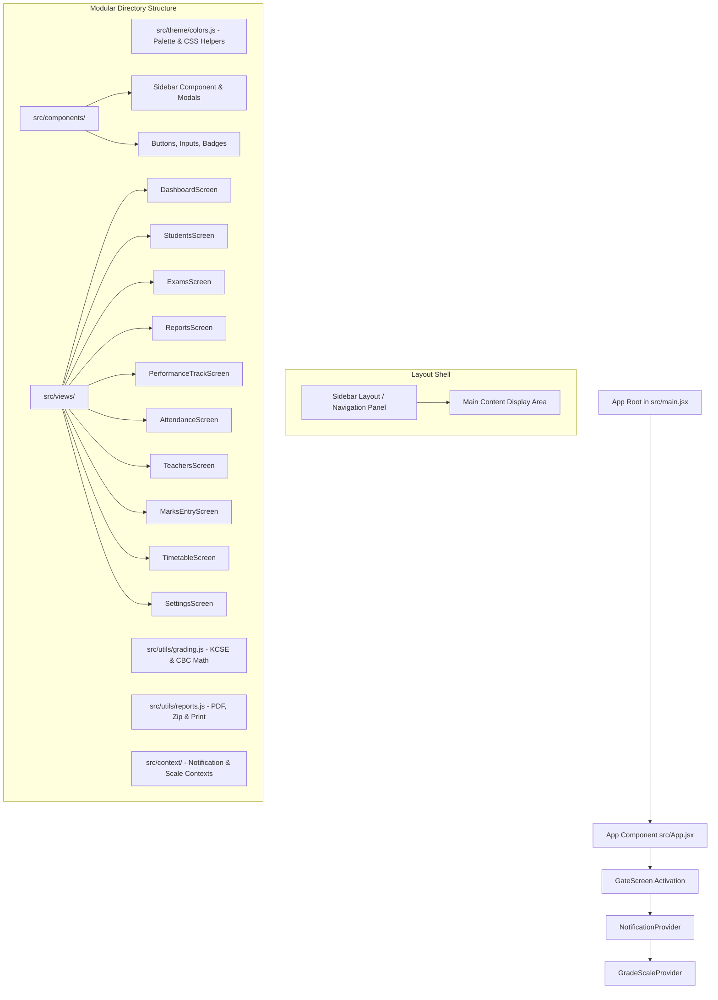

# Architectural Review and Improvement Plan

## 1. Architectural Structure Review (`src/App.jsx`)

### Current State
[`src/App.jsx`](src/App.jsx) is a monolithic file containing **4,177 lines of code**. It houses all application concerns together:
- **Theme & Styles**: Inlined style objects (`COLORS`, `btn`, `input`, `modalCard`, `pageWrap`).
- **Domain Logic & Helpers**: KNEC and CBC calculation utilities (`kcseGrade`, `cbcLevel`, `computeKcseAggregate`, `computeCbcTotal`, exclusion pair checkers).
- **Context Providers**: [`NotificationProvider`](src/App.jsx:74) and [`GradeScaleProvider`](src/App.jsx:2441).
- **Authentication Views**: Login, Signup, GateScreen, ChangePasswordModal, PendingApproval.
- **Top Navigation**: [`TopBar`](src/App.jsx:349).
- **Primary Page Views**:
  - `DashboardScreen`
  - `StudentsScreen` (+ Add/Edit/Import modals)
  - `ExamsScreen` (+ `ExamMarksOverview`)
  - `ReportsScreen` (+ PDF generation, ZIP packaging, Print, WhatsApp helpers)
  - `PerformanceTrackScreen`
  - `AdminAttendanceScreen` & `TeacherAttendanceScreen` (+ `AttendanceCore`)
  - `TeachersScreen` (+ `PromoteToAdminModal`)
  - `MarksEntryContent` & `MarksEntryScreen`
  - `SettingsScreen`

### Key Architectural Bottlenecks
1. **Maintainability & Modularity**: Finding or updating specific functionality requires navigating through 4,000+ lines in a single file.
2. **Re-render Scope**: State updates inside shared providers or individual tabs force large component trees to re-render.
3. **Testability**: Calculation logic (e.g. KCSE best-7 aggregates, CBC levels, report card HTML builders) cannot be unit tested independently because it is bound to component scope in [`src/App.jsx`](src/App.jsx).
4. **Code Reusability**: Helpers and modal primitives are tightly coupled to page components.

---

## 2. Target Architecture (Modular Decomposition & Sidebar Navigation Layout)

---

## 3. Planned Features & Modifications

### A. Sidebar & Hamburger Layout Redesign (Instagram-style Side Panel)
- Replace top tab horizontal header with a responsive vertical **Sidebar Navigation Panel**:
  - Persistent left sidebar panel on desktop screens with icon + text navigation items.
  - Collapsible drawer / hamburger menu toggle on mobile and small screens.
  - School Crest branding and user profile badge at the top/bottom of the side panel.
  - Clicking menu items (Dashboard, Students, Exams, etc.) seamlessly updates the main content area on the right.

### B. Admin Marks Editing (Dean, Deputy, Principal, Manager, Director Access)
- Enable Leadership Admins (`Principal`, `Deputy Principal`, `Dean of Studies`, `School Manager`, `Director`) to directly enter and edit marks for **any** class and **any** subject without needing to self-assign teacher rows beforehand.
- Add subject and cohort selectors in the Admin Marks Entry view so admins have full administrative control to correct or enter student scores across all subjects.

### C. Modular Decomposition (Refactoring)
- Extract theme constants (`COLORS`, style helpers) into `src/theme/index.js`.
- Extract grading calculation utilities (`kcseGrade`, `cbcLevel`, `computeKcseAggregate`, `computeCbcTotal`) into `src/utils/grading.js`.
- Extract context providers into `src/context/NotificationContext.jsx` and `src/context/GradeScaleContext.jsx`.
- Extract page screens into standalone components inside `src/views/`.

### D. New Leadership Accounts: School Manager & Director
- Update `TITLE_LIMITS` to include:
  - `Principal`: limit 1
  - `Deputy Principal`: limit 2
  - `Dean of Studies`: limit 1
  - `School Manager`: limit 1
  - `Director`: limit 1
- Update Signup and [`PromoteToAdminModal`](src/App.jsx:3210) dropdown options to include `School Manager` and `Director`.

### E. Grade 10 CBC Grading Scale Management
- Extend `grade_scale` state/context or create a dedicated tab/section in `SettingsScreen` for Grade 10 CBC levels (`EE1`, `EE2`, `ME1`, `ME2`, `AE1`, `AE2`, `BE1`, `BE2`).
- Allow admins to edit minimum score cutoffs for CBC levels and save them to Supabase database.

### F. Delete Exam with Associated Marks
- Add a "Delete Exam" button next to each exam in `ExamsScreen` ([`src/App.jsx:1774`](src/App.jsx:1774)).
- Enforce confirmation modal warning that deleting the exam permanently removes all recorded student marks and report card records for that exam.
- Delete marks and report cards linked to `exam_id` before removing the exam entry.

### G. Teacher Timetable (Scaffolding & UI Integration)
- Add a "Timetable" item in the Sidebar navigation panel for teachers and admins.
- Create initial timetable viewing component structure `src/views/TimetableScreen.jsx` for class and teacher schedules.

---

## 4. Execution Todo Checklist

- [ ] Design and build responsive Sidebar Navigation Panel (with hamburger toggle for mobile view)
- [ ] Allow Dean, Deputy, Principal, Manager, and Director to select any subject & class to edit marks directly
- [ ] Extract styling constants and theme helpers into `src/theme/index.js`
- [ ] Extract grading and aggregate calculation functions into `src/utils/grading.js`
- [ ] Create `School Manager` and `Director` roles/titles with slot limits in signup and promotion modals
- [ ] Implement Exam deletion functionality in `ExamsScreen` with cascade removal of associated marks
- [ ] Add Grade 10 CBC level cutoff configuration in `SettingsScreen`
- [ ] Scaffold `TimetableScreen` tab for teacher subject schedules
- [ ] Split monolithic [`src/App.jsx`](src/App.jsx) views into modular files under `src/views/`
